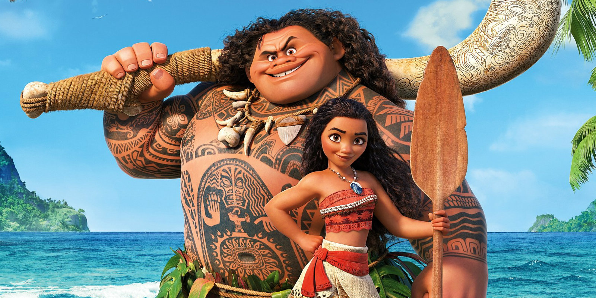
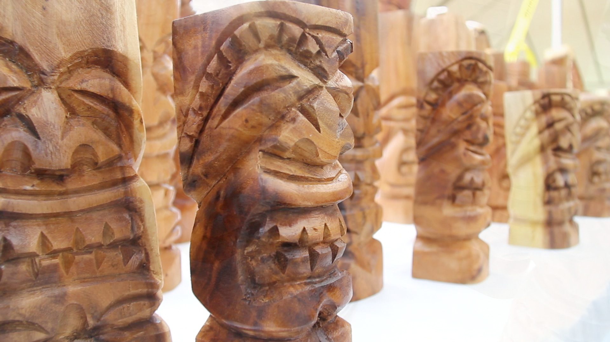
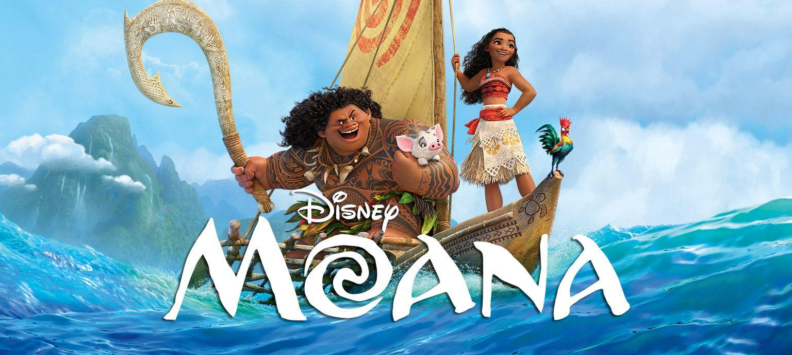

In order to begin analysing the typography of *Moana,* we first need to observe the cultural influences of the film. The film is set on the fictional island of Motunui, said to reside in the Pacific Ocean. The island itself is described as “Pan-Pacific” by Disney, and certainly draws on the cultural influences of Pacific islands. Personally, I think the visual references of Motunui prominently draw on Hawaiian culture, with Hawaiian-inspired tattoo design, clothing, jewellery and settings. Many of the clothing, houses and utensils used by the villagers appear to be crafted out of wood or bone, as can be seen in the picture below.

Which brings us onto the typography. The typographic design of *Moana* is quite difficult to put into one box. Let’s start with the type classification. Some of the letters have a slight serif. Often, serif fonts are attributed to luxury and sophistication, but I don’t think that’s the purpose of this design choice. Instead, I think the slight flicks and flourishes give the impression of craftsmanship, and something handmade. Interestingly, the serifs are a similar shape to the sails on Moana’s boat, so that the letters almost appear to be bending to the wind. The slight jaunty angle of the letters also give the impression of motion and movement. The letter ‘O’ in particular has a distinct novelty feel, which I think perfectly reflects themes of water. Considering that the ocean is key to the plot of the film, the typographic design compliments the storytelling well.

If we look at the type characteristics, the cap-height is quite high. My thinking behind this is that uppercase text would be easier to carve by hand, and the logo itself has a deliberately handcrafted feel. There’s a fair amount of x-height, particularly on the letter M, but the compression of the letters avoids too much white space. Again, I think this is a call to the handcrafted element, as if someone tried to fit the letters onto a stone or piece of wood. The text is also high contrast, perhaps mimicking the impressions of a cutting tool (see above for traditional Hawaiian wood carvings).

To me, the typographic voice is particularly hard to pin down. The text certainly feels organic, and is slightly more tentative than emphatic. It has a casual quality, yet the capital lettering and thicker lines also make the letters look sturdy and strong. The typography is slightly imperfect and wobbly, which again gives the lettering a human touch. Whilst the uppercase letters make the logo look sturdy and impactful, the little flourishes and imperfections give the design a human quality and a distinct personality.

