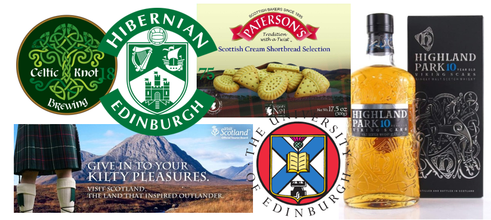
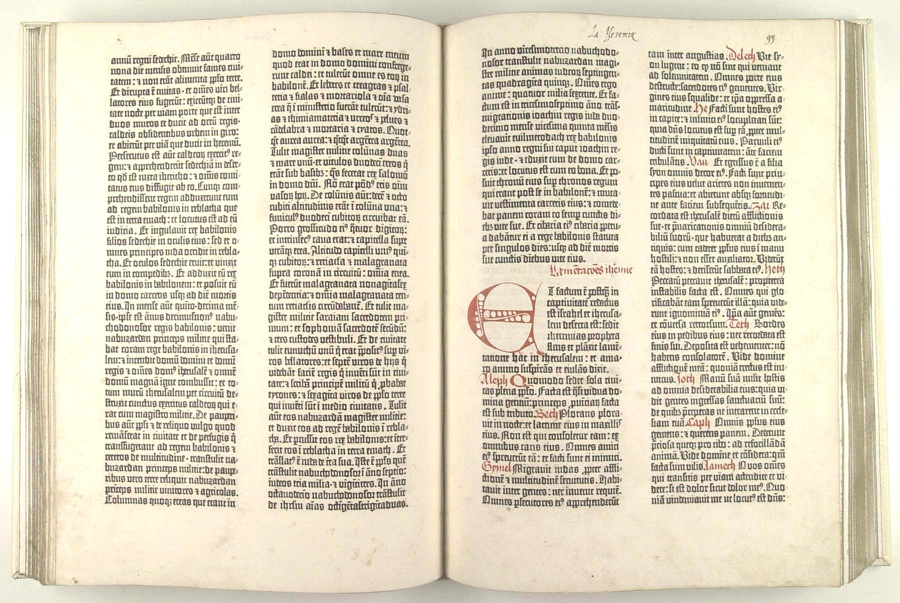
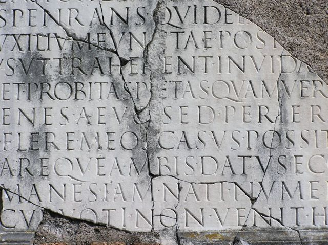
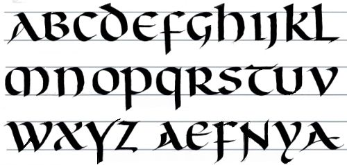
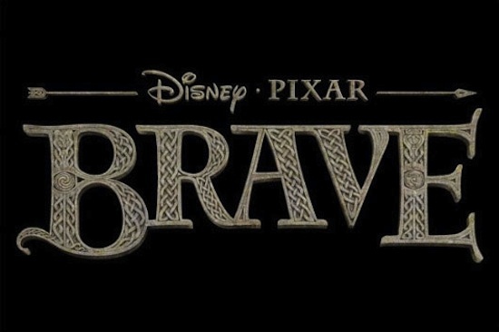

Much like the typographic design for *Moana,* the typography for *Brave* draws heavily on historical and cultural influences. As soon as I saw the film poster, I could tell that the story was set in Celtic Scotland, simply from the typography. As someone who is half-Scottish, I am very familiar with Celtic typographic design, which can be found on shortbread tins, whiskey bottles and tartan clothing labels. However, I realised that I know very little about the origins of this typography.

Initially, the typography reminded me most of Blacklettering. Blackletter, sometimes known as Gothic Script, can be traced to early bibles created by monks, written using a quill and ink. This same stylistic approach was used in the 15th century for the Guternberg Bible, printed in a type emulating the writing of said monks.

Interestingly, when I looked further into Celtic and Gaelic typography, I discovered the style of Uncial typography. The Uncial script was first used during the late 2nd century, and actually influenced the majority of early typographic styles. Prior to Uncial typography, there were two main typographic styles being used in Europe; Roman Rustic and Roman Square Capitals (see image below). Roman typographic design, (such as Times New Roman), relies on clean, straight lines, as the words were traditionally carved into stone.

However, once papyrus, parchment and animal skin were available to write on, people realised it was quite difficult for a human hand to replicate perfectly straight lines with ink. Naturally, we write with an angle, which is how Roman Rustic developed: a slightly more cursive adaptation of Roman Square Capitals. Overtime, popular cursive Greek script blended with Roman Rustic to create the traditional Uncial text.

Before the Romans invaded, very few people could read or write in Britain. As the Romans transcribed their history, literature and laws, it wasn’t long before Celtic people began to learn to write too. It isn’t surprising, therefore, that Celtic typography is inspired by Roman Uncial lettering.

The typography of *Brave* clearly mimics this typographic design. You can clearly see the transition between the straight, clean lines of Roman Square Capitals, and the cursive, human serifs of Uncial lettering. The letters themselves look as if they have been carved into stone, with intricate looping designs. Stone masonry is an ancient craft traditionally practiced in Scotland and Ireland, and can be traced back to the popular design of the Celtic Cross. The Celtic Cross represents a never-ending story and ancient heritage, themes which are integral to the plot of Disney’s *Brave.* Overall, I think the typographic design perfectly illustrates the Celtic culture and traditions which influencing the feel, design and storyline of *Brave.*

*For more information on Uncial script, watch this video:* 

<https://www.youtube.com/watch?v=VU-dHTEkAx0>

*For a history of the Celtic Cross, watch this:*

<https://www.youtube.com/watch?v=FJT3cuM7teM>