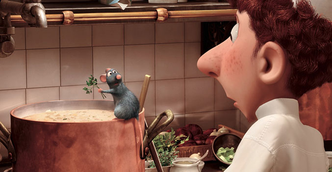
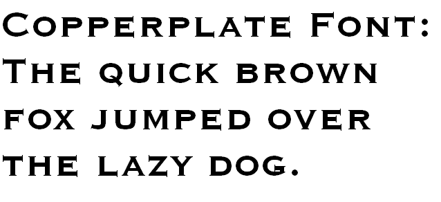
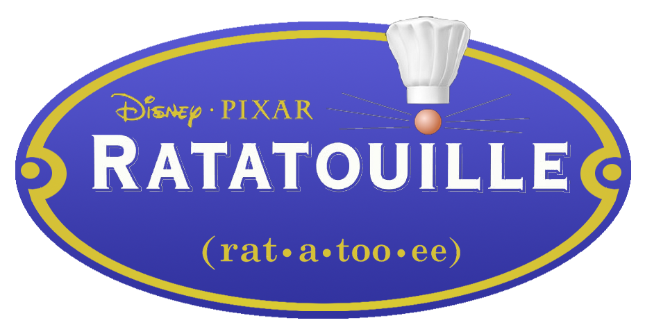

This week I decided to take a look at the typography of the 2007 Disney Pixar film *Ratatouille.* Unlike some of the previous fonts I have analysed, this week’s typography does not seem especially unusual. It does not appear handmade or crafted, and lacks a certain flair and self-expression. But I would argue that this is exactly the point Disney and Pixar were hoping to make.

To analyse the design of *Ratatouille,* it helps to know a bit about the plot of the film. *Ratatouille* tells the story of an anthropomorphic rat named Remy, who dreams of being a chef. One night, he sneaks into the kitchen of a famous French restaurant, and notices a cleaner adding ingredients to a soup. Realising that the soup is doomed, Remy alters the recipe to create something delicious. When everyone in the restaurant loves the dish, Remy teams up with cleaner Linguini to take the French cooking world by storm. The plan will work flawlessly, so long as nobody realises there is a rat in the kitchen.

With this in mind, the simplistic design of the typography ties in perfectly with the film. The typography is written in Copperplate Gothic, a typeface designed by Frederic W. Goudy in 1901. The typeface combines glyphs reminiscent of stone carvings, while remaining crisp and clean. Goudy designed Copperplate Gothic in capital letters, as the design was intended to be used for headings such as shop signs, which would need to be clear, impactful and easy to read. According to Wikipedia, Copperplate Gothic is typically seen acid-etched into glass on the doors of “law offices, banks and restaurants”. All of these professions pride themselves on cleanliness and transparency, and a prominent level of trust; banks need customers to trust them with their money, while restaurants must appear as neat and clean as possible to reflect their hygiene levels.

The rat has long been known as the antithesis of cleanliness, responsible for spreading plague and disease, and often found festering in sewers and squalid buildings. The key plot driver of *Ratatouille* is protagonist Remy’s stark contrast to his setting; the film focuses on the relationship between pristine kitchen and seemingly dirty rat. The colours of the typographic design reflect these themes too; white and blue are often associated with cleanliness and transparency. After all, a kitchen should have nothing to hide, least not a rat with culinary skills. I particularly like the logo design featuring a rat nose and whiskers above the otherwise perfect Copperplate text, as if Remy is hiding in plain sight. In this logo, Remy’s nose both completes the logo and stands out from it, which perfectly reflects the storyline. Remy the rat may complete the kitchen as a skilled chef, but his nature is entirely out of place.

