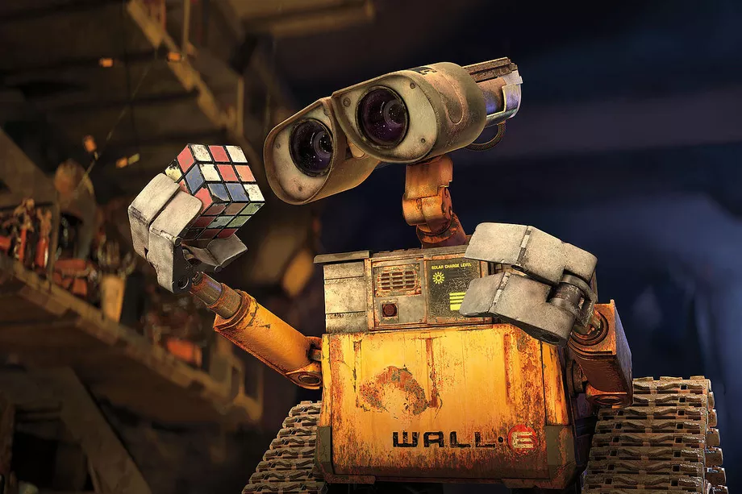
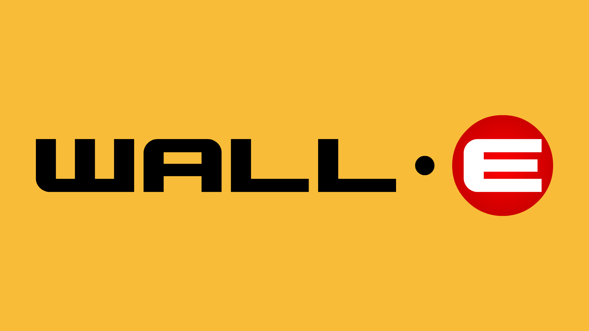
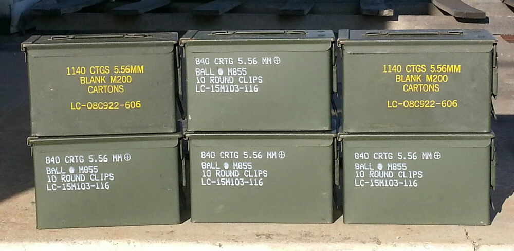

Stylistically speaking, the typographic design for the 2008 film *WALL-E* is the most simplistic font I have looked at so far. The text is uppercase, and without flourishes or serifs, with a consistent cap-height across the letters. The letters are also low-contrast and geometric, so they do not look as if they were made by a human hand. In terms of typographic voice, I would describe the logo as emphatic and rigid. However, much like the typography for *Ratatouille,* I think the simplistic design represents *WALL-E* perfectly.

Before we analyse the film’s typography, it helps to know a little about the storyline. *WALL-E* is actually a brand name within the film, which stands for ‘*Waste Allocation Load Lifter Earth-Class’.* In a dystopic future, a WALL-E is a robot tasked with collecting and compressing the litter covering the entire planet. ‘WALL-E’, the robot protagonist, is the only remaining robot of his kind, after 700 years of service. The robots are designed to repeat the mundane job of compressing waste into cubes, and are not programmed to have interactions. However, after all this time, WALL-E has developed a complete and curious personality. We follow WALL-E as he finds love, travels to space, and tries to save planet Earth.

When we consider the storyline, it makes sense that the text design is without flourishes. In Disney Pixar’s futuristic dystopia, all humans have abandoned the Earth and left robots to clean up their waste. The low-contrast, uppercase text has no trace of humanity or artistic design, and instead looks as if it has been printed using a machine. In fact, as the logo appears on the robots themselves, we get the impression that the text has been transferred onto the metal in a factory.

The letter ‘E’ is quite interesting, as it is white and centred on a red circle, unlike the rest of the text. I think this is because these robots are placed on Earth, unlike their outer-space counterparts. Since their location is the focus of their purpose (cleaning Earth), it makes sense that this letter would be highlighted.

The logo reminds me most of stencilled text, which is often seen on army or emergency services vehicles and equipment. Such text is not trying to convey a strong brand value, other than appearing efficient, reliable and trustworthy. Typography such as this is usually found on mass-produced equipment which needs to be made quickly and efficiently, which is perhaps why the design is so simplistic. Therefore, it makes sense that the typography on the WALL-E robots is of this style.