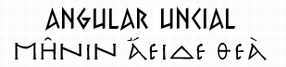

The typographic design for *Hercules* (1997) reflects both the storyline and the historical references of the film. The story draws heavily on traditional Greek mythology, so it makes sense that the typography would mimic traditional Greek design.

To summarise the story, Hercules, son of Zeus, is born a God like his father. His uncle Hades curses the child, transforming him into a seemingly weak and hapless mortal. Hercules is raised on Earth by mortals, oblivious to his true parentage. However, when Hercules discovers he is in fact half-God, he travels to Mount Olympus in the hope of becoming a true hero. The film follows his trials, successes and failures as Hercules transforms *“from zero to hero”*, and from boy to God.

Aside from the hammered gold lettering, which has obvious ties to gold medals and Olympic glory, the text itself is something of a mystery. Typically ‘Greek’ text can often be seen on Greek restaurants and paraphernalia (see below), but I am unsure of the origin. I would argue that the *Hercules* logo matches this ‘Greek’ typographic style, with its straight, thin lines.

My first impression of the *Hercules* logo is that it reminds me of runic typography. Although the bulk of the lettering is gold, the gold is embossed with thin, runic lines, which look as if they have been carved or stamped into the metal. However, when I started to research runic typography, I found that this typeface is usually attributed with Scandinavian heritage and dates back to the Vikings. However, these runes did not have the almost imperceptible curves and flourishes which can be seen on some of the letters in our logo. The *Hercules* logo has the slightest serifs on some letters, which hints at an artistic purpose, unlike Viking runes which were designed to be quick and easy to carve into wood or stone.

But how do Viking runes connect to Ancient Greece? This took a certain amount of detective work; I found myself looking into archaeological discoveries and museum catalogues. Eventually, I found record of the *Bacchylides papyrus,* currently archived at The British Museum (see below).

The scroll, containing an excerpt of writing by the Greek poet Bacchylides, is thought to be dated to the first century B.C. What’s intriguing, is that the script bears a definite similarity to typically ‘Greek’ typography, in this runic style. Since the discovery of this scroll, the term ‘Angular Uncial’ has been coined to describe this ‘Greek’ typographic design.

I can only imagine that the material of papyrus caused Greek writers to adapt their handwriting into straight lines, to allow for such a scratchy writing surface. Perhaps this is where the inspiration for this particular logo lies? It is certainly something I would be interested to explore further in future.  

