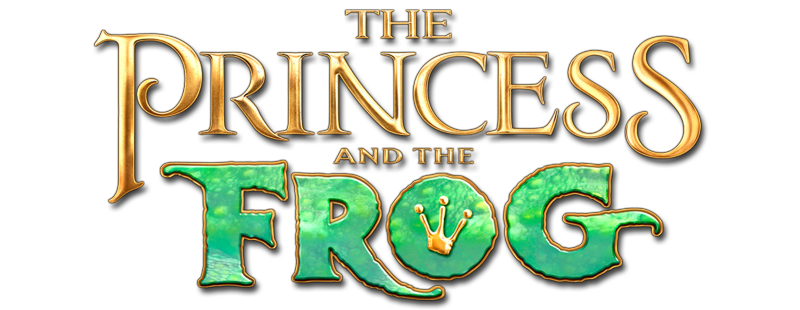
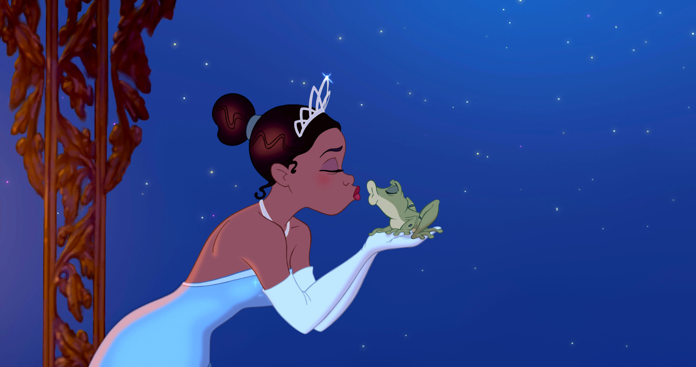

This week we will study the typography of the 2009 picture *‘The Princess and the Frog’,* released by Walt Disney Pictures alone. Interestingly, *The Princess and the Frog* was the studio’s first hand-drawn movie in five years, breaking away from Pixar-influenced CGI, to replicate their traditional animation style. The soft colours, sumptuous drawings and Jazz-age setting give the film a nuanced, crafted and human quality. However, the logo contrasts decidedly with the animation style.

The typography itself looks computer-generated; it is high-quality, sleek and textured. Initially, I was puzzled as to why the typography utilises CGI, when the film itself is hand-drawn. I realised that *The Princess and the Frog* was unorthodox at the time of release, and would have been entering a highly CGI-saturated market. The hand-drawn animation gave the picture a nostalgic quality, but the studio would not want to appear outdated. Perhaps this is why the logo, which would have been seen on posters and merchandise, uses CGI. This way, viewers can appreciate the animation style as novelty, whilst the typographic design clearly brings the film up to date.

Sharp contrast is key to the typographic design, and to the plot of the film. Although based on the Brothers Grimm story ‘*The Frog Prince’, The Princess and the Frog* is set in a 1920s Black community in New Orleans. Waitress Tiana dreams of opening her own restaurant, although she struggles to get by. After meeting a talking frog named Naveen, Tiana’s world is turned upside down. When she finds out that the frog is actually a prince, cursed by a voodoo witch doctor, Tiana tries to break the spell with a kiss. Which is a brilliant plan, until the kiss turns Tiana into a frog.

I think character is the real driving force of the typographic design, which focuses on Tiana and Naveen. The word ‘Princess’ appears fine and elegant, with swooping curves and serifs. The line width is thin and delicate, which reflects traditionally feminine ideals. In contrast, the word ‘Frog’ has a stocky, emphatic quality, typically associated with masculine tropes.

I really love the design of the word ‘Frog’, which combines the shimmering gold used for the rest of the logo, and a textured, swamp-like green. This combination perfectly reflects Naveen’s character; a golden prince trapped within the body of a frog. I also appreciate the crown shape used for the centre of the letter ‘O’, which also cleverly resembles the footprint of a frog. Overall, I think the design represents the film and characters really well, and acts as a compelling introduction to the story.