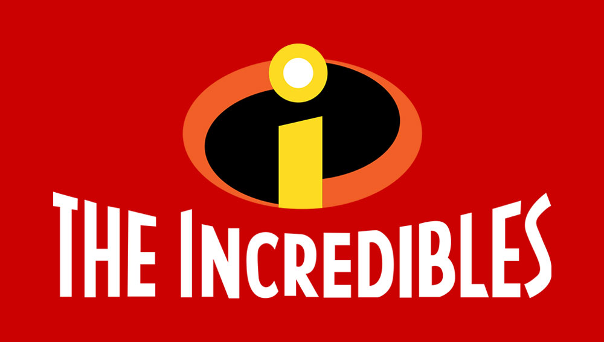
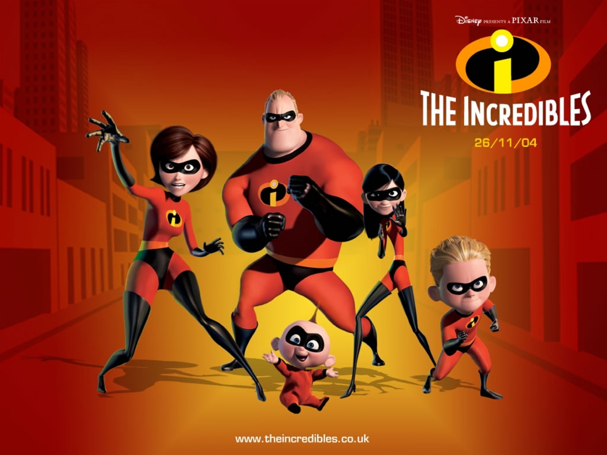
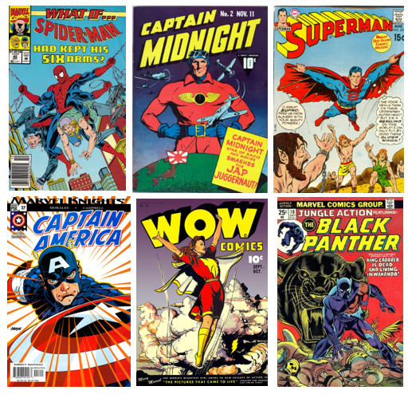
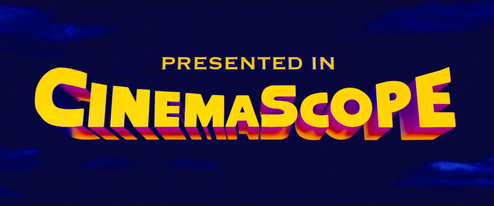

This week I have decided to analyse the typography of the 2004 Disney Pixar film *‘The Incredibles’.* Unlike any of the previous fonts, the logo for *The Incredibles* includes a title design and a typographic icon. While both use the same typography, the icon is coloured differently and uses only lowercase text.

The film itself follows the story of two superheroes, Mr Incredible and Elastigirl, who fall in love and start a family. After a rescue-mission gone wrong, superheroes are banned by the police, and the couple must learn to live without the use of their powers. This is made all the more difficult as their three children develop superpowers too. However, when a supervillain emerges, the family have no choice but to leave their civilian lives behind and become ‘The Incredibles’.

The typographic logo is especially interesting. It uses a lowercase ‘i’, which I think is designed to look like an actual eye. Again, the design looks sleek and filled with movement, with swooping curves. The colours are reminiscent of danger – red, black, orange and yellow. We typically see these colours used on warning signs, and I believe that they register with our subconscious as a result.

The typography itself is uppercase, empathic and rigid, suggesting that the superhero team are both reliable and impenetrable. When we look at early superhero comics (see below), this style of typography is common. Uppercase text is also hard to ignore, and would no doubt catch the eyes of children perusing superhero comics in the newsagents. Superheroes such as Mr Incredible often have superior strength, which is perhaps another reason why this emphatic, heavy-looking design has been used.

Another interesting observation is that of the artistic quirks in the typography. Some letters, such as the letter ‘I’, slope slightly, which gives the text the quality of movement. Again, this is a common theme seen in comic book typography. Superhero stories are usually action-packed and filled with excitement, and seemingly ‘moving’ text reflects this.

The shape of the typography also reminds me of the CinemaScope logo (see below) of the 1940s and 60s. CinemaScope used a special lens which allowed films to fill a much larger cinema screen. To emphasise this point, the CinemaScope logo appears to stretch and fill as much of the screen as possible. Similarly, *The Incredibles* logo also dominates the screen, resulting in a design which is hard to ignore.

