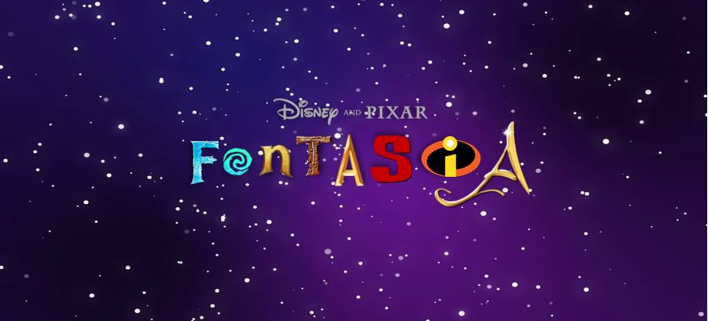
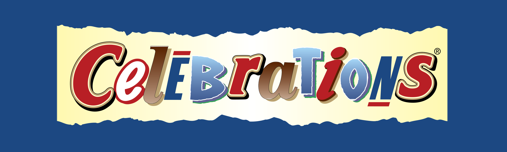

**Introduction**

Hello! Welcome to Fontasia.

This blog was created for the Typography Module, as part of my degree in Media, Journalism and Publishing. Our brief is to explore a particular type of typography, producing articles on our findings.

In this particular blog, I will look at the typography used for individual Disney and Disney Pixar films. I noted that each film has its own branding, which gives it a distinctive feel. Alongside the imagery and colour palettes, many Disney films have corresponding logos, and they all have their own typography. 

Each article will focus on a different film, examining the posters, logos and merchandise, and their corresponding typography. I want to discuss the purpose of each typographic choice, whilst ruminating on their effectiveness in reflecting the films they represent. 

I hope you will find the contents interesting!

Thanks for reading,

Anna

**A Note on the Design of 'Fontasia'**

The idea for my header design came to me quite quickly. I wanted to find a clear and effective way to showcase the key purpose of my blog: to analyse branding in Disney and Disney Pixar films. Initially, I toyed with the concept of a header written in Walt Disney's signature handwriting, but I wasn't sure that this would convey my purpose clearly enough. I needed my audience to instantly understand that the website would be focusing on the typography of Disney films.

**Developing the Header**

The biggest problem when designing my header was working out how to encompass a multitude of brands and designs into one image. I considered companies that have achieved this effect, and instantly thought of the logo design for Mars' popular chocolate selection box 'Celebrations'. Mars solved this exact dilemma by creating a logo using typography from every single chocolate brand featuring in their box. That may seem ludicrous, but the design works perfectly. In combining letters from a contrasting range of brands, the logo looks both exciting and full of variety. 

What's quite fun